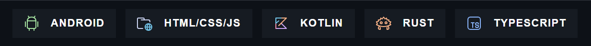

  

  ---
  
   

# My Profie 🦆 

Hi! My name is Ethan, a teen developer from the UK. Ever since getting a Raspberry Pi for my 7th birthday, I have always wanted to make things for people. 
From web apps, to silly python scripts, I really make what ever comes to mind. Take a look at my stats and stack below:

## Tech & Stats 

## What else do I do?
I don't just code here! I am a solo developer at [Neo Studios](https://github.com/Neo-Studios), and have assisted with many projects over at [BuildOne](https://github.com/BuildOneRobotics). 

>[!NOTE]
> Hey! Quick note: the wonderful people over at https://github.com/anuraghazra/github-readme-stats are having some issues at the moment, so the stats will be broken for a while. 